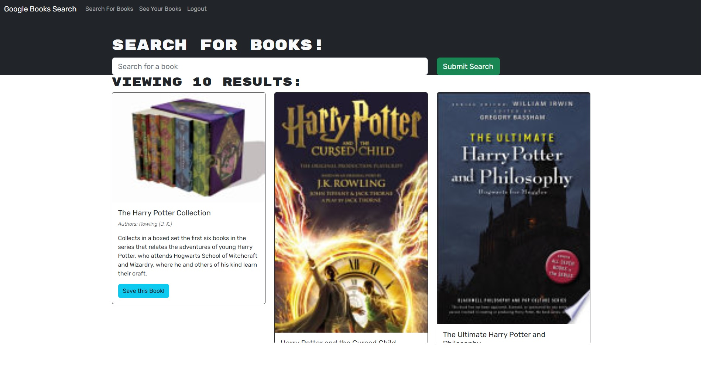

# Book Search Engine

Deployed Website 

https://helpful-melomakarona-ae2244.netlify.app/

Repository Website

https://github.com/RudezY/Book-Search

## Table of Contents 
  [Description](#description) 
  [Installation-Instructions](#installation-instructions) 
  [Usage-Information](#usage) 
  [Contributing-Guidelines](#contribution) 
  [Testing-Instructions](#tests) 
  [Questions](#questions)

  ## The Title of the Application
React Portfolio

## Description
This project us a book search website that will allow you to save and remove books that you save when logged in. You will have to sign in or sign up to be able to add your books to a list, but once you sign in you can begin adding. 
 ## Installation Instructions
You will need to run npm i to install the node modules from the root package.json. After the modules are installed you will run npm run develop to locally run both the server and client side.
## Usage
It could be used as a website to keep tracks of books that you would like to read and remove them to mark them off your list of future books to read.

 ## Contribution
 n/a

 ## Tests
 n/a

## Questions
If you have any questions you can reach out to me at RudezY on github

